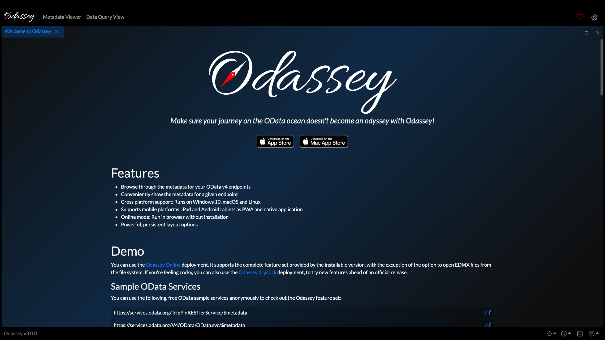
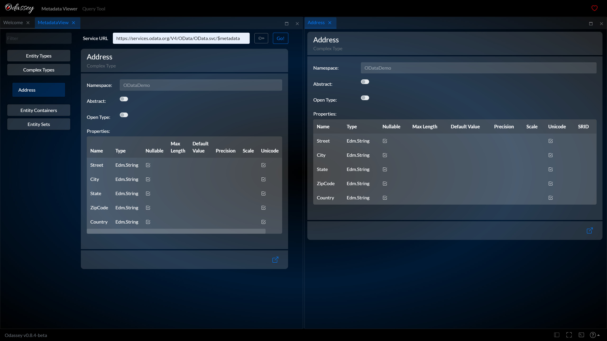
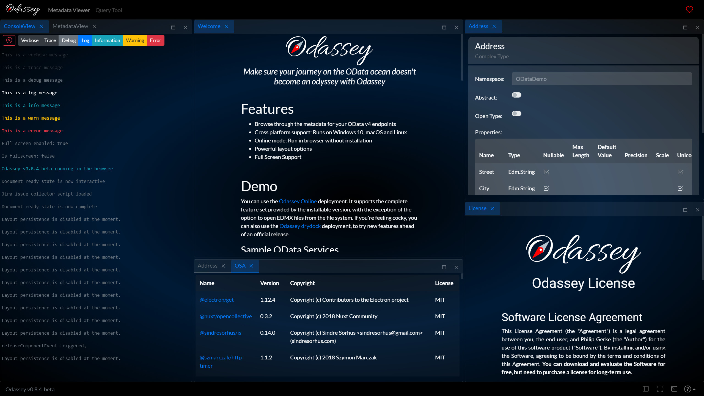
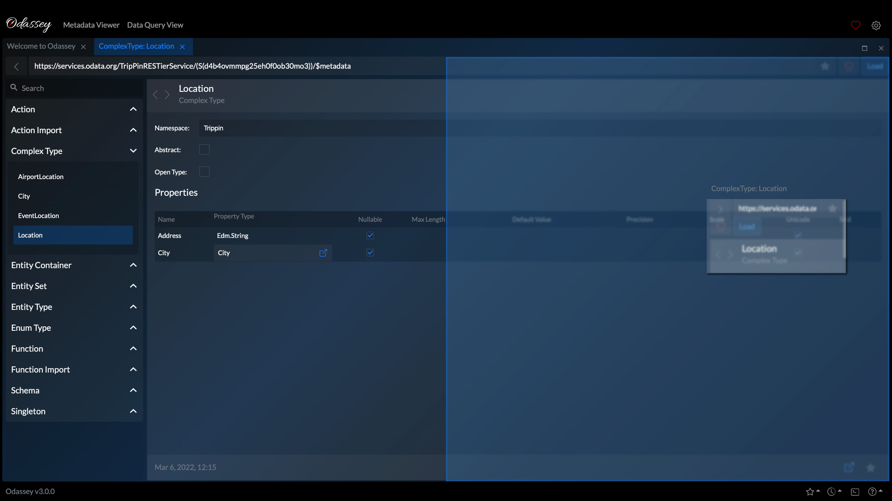
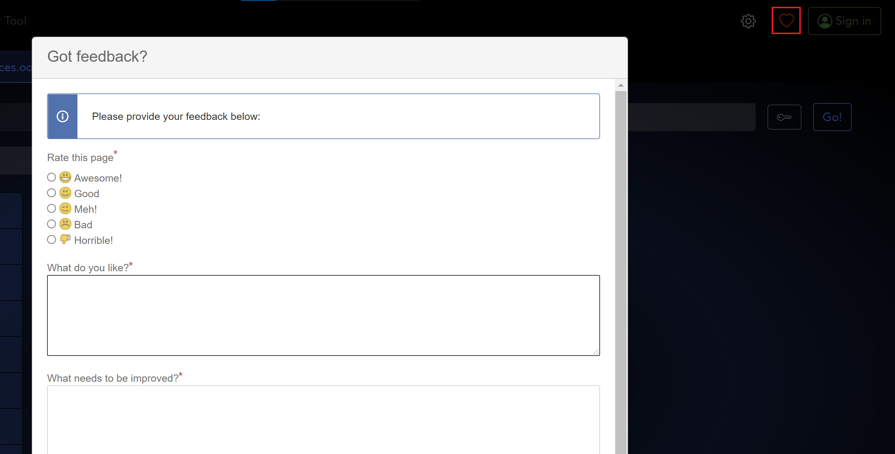
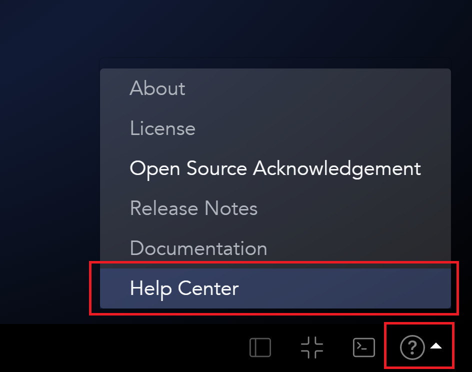

#  #
*Make sure your journey on the OData ocean doesn't become an odyssey with Odassey*

## Features ##

- Browse through the metadata for your OData v4 endpoints
- Cross platform support: Runs on Windows 10, macOS and Linux
- Online mode: Run in browser without installation
- Supports mobile platforms as PWA: iPad, Android tablets
- Powerful layout options

## Demo ##

You can use the [Odassey Online](https://odassey.philipgerke.com) deployment. It supports the complete feature set provided by the installable version, with the exception of the option to open EDMX files from the file system. If you're feeling cocky, you can also use the [Odassey drydock](https://drydock.philipgerke.com) deployment, to try new features ahead of an official release.

### Sample OData Services ###

You can use the following, free OData sample services anonymously to check out the Odassey feature set:
- https://services.odata.org/TripPinRESTierService/$metadata
- https://services.odata.org/V4/OData/OData.svc/$metadata
- https://services.odata.org/V4/Northwind/Northwind.svc/$metadata

*Please note that Odassey is neither the owner of the aforementioned services nor in any way affiliated with the services  their respective owners.*

## Screenshots






  
## Installation ##

You can install Odassey by directly downloading an installer for your platform or by using a package manager. Once installed Odassey automatically informs you about new releases.

### Package Manager ###

At the moment we are only supporting winget, but the target is to support a package manager for all supported operating systems.

#### Windows - Winget ####

```powershell
winget install odassey
```

Soon, you'll also be able to install the drydock version. 👀


### Installer ###

You can find the installers for all platforms and releases at our releases page over at GitHub at https://github.com/pgerke/get-odassey/releases.
    
## Roadmap ##

- Layout Persistence
- Add more authentication options: OAuth1 and OAuth2
- Data Queries
- Additional package managers: Homebrew, Snap
  
## Feedback & Support ##

If you have any feedback, email support@odassey.de or use the feedback from integrated into Odassey.

For support you can also use our [GitHub repository](https://github.com/pgerke/get-odassey) the [Odassey Help Center](https://pgerke.atlassian.net/servicedesk/customer/portal/1).
You can access the help center by selecting the corresponding link in the support menu.


Made with ❤️ by [Philip Gerke](https://github.com/pgerke)
