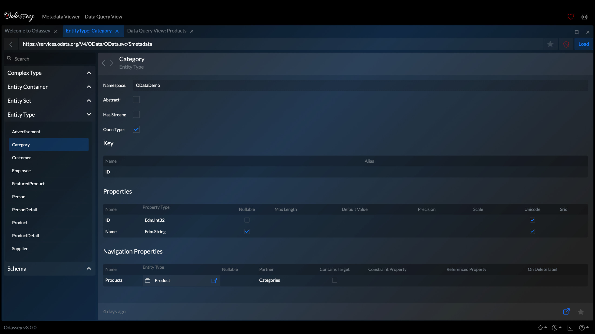
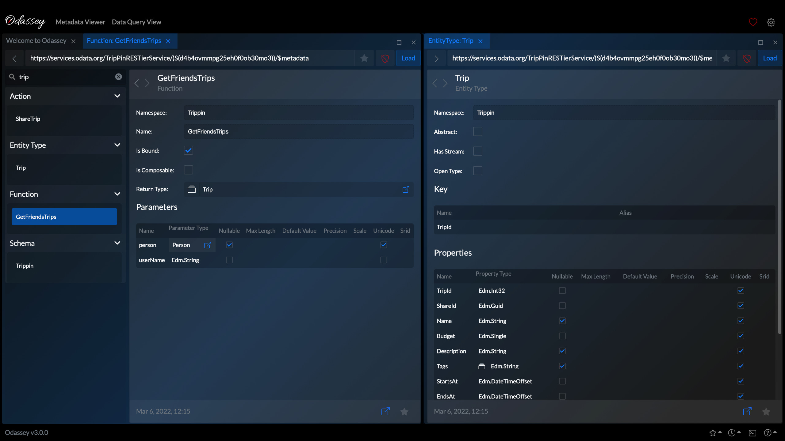
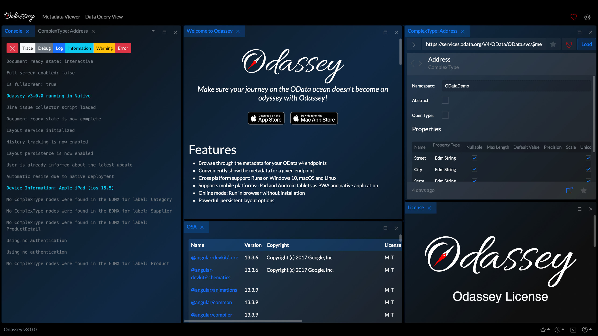

# 

_Make sure your journey on the OData ocean doesn't become an odyssey with Odassey_


## Features

- Browse through the data for your OData v4 endpoints
- Conveniently show the metadata for a given endpoint
- Cross platform support: Runs on Windows 10, macOS and Linux
- Also supports mobile platforms: iPad and Android tablets as PWA or native app,
- Online mode: Run in browser without installation
- Powerful, persistent layout options

## Demo

You can use the [Odassey Online](https://odassey.philipgerke.com) deployment. It supports the complete feature set provided by the installable version, with the exception of the option to open EDMX files from the file system. If you're feeling cocky, you can also use the [Odassey drydock](https://drydock.philipgerke.com) deployment, to try new features ahead of an official release.

### Sample OData Services

You can use the following, free OData sample services anonymously to check out the Odassey feature set:

- https://services.odata.org/TripPinRESTierService/$metadata
- https://services.odata.org/V4/OData/OData.svc/$metadata
- https://services.odata.org/V4/Northwind/Northwind.svc/$metadata

_Please note that Odassey is neither the owner of the aforementioned services nor in any way affiliated with the services their respective owners._

## Screenshots








## Installation

You can install Odassey by directly downloading an installer for your platform or by using a package manager. Once installed Odassey automatically informs you about new releases.

### Package Manager

At the moment we are only supporting winget, but the target is to support a package manager for all supported operating systems.

#### Windows - Winget

```powershell
winget install odassey
```

Soon, you'll also be able to install the drydock version. 👀

### Installer

You can find the installers for all platforms and releases at our releases page over at GitHub at https://github.com/pgerke/get-odassey/releases.

## Roadmap

- Native apps for Android
- App Store deployment
- Query code generation
- Add more authentication options: OAuth1 and OAuth2
- Additional package managers: Homebrew, Snap

## Feedback & Support

If you have any feedback or want to report an issue you can use our [GitHub repository](https://github.com/pgerke/get-odassey) or write us an [email](mailto:support@philipgerke.com).

## Privacy Policy

Long story short: As an application Odassey does not collect data of any kind with the exception of server logs. Please check out our [Privacy Policy](https://privacy.philipgerke.com/) for details.

Made with ❤️ by [Philip Gerke](https://github.com/pgerke)
