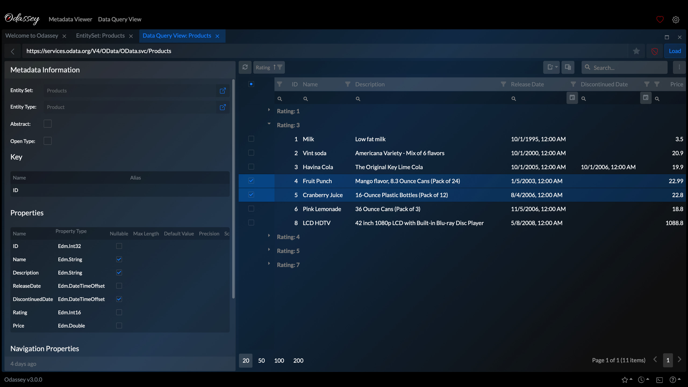

# 

_Make sure your journey on the OData ocean doesn't become an odyssey with Odassey_

## Features

- Browse through the metadata for your OData v4 endpoints
- Conveniently show the metadata for a given endpoint
- Explore the data provided by our entity sets with a rich experience
- Powerful, persistent layout options
- Cross platform support: All you need is a browser!
- Native installation supported

#### Check it out now at [odassey.philipgerke.com](https://odassey.philipgerke.com)!

## Screenshots

### Sample OData Services

You can use the following, free OData sample services anonymously to check out the Odassey feature set:

- https://services.odata.org/V4/OData/OData.svc/$metadata
- https://services.odata.org/V4/Northwind/Northwind.svc/$metadata
- https://services.odata.org/TripPinRESTierService/$metadata

_Please note that Odassey is neither the owner of the aforementioned services nor in any way affiliated with the services their respective owners._

## Roadmap

- Query code generation
- Add more authentication options: OAuth1 and OAuth2

## Feedback & Support

If you have any feedback or want to report an issue you can use our [GitHub repository](https://github.com/pgerke/get-odassey) or write us an [email](mailto:support@philipgerke.com).

### Sundown for native application

Starting with v3.1.0 support for native applications based on Electron or iOS / iPadOS / macOS is discontinued.

## Privacy Policy

Long story short: As an application Odassey does not collect data of any kind with the exception of server logs. Please check out our [Privacy Policy](https://privacy.philipgerke.com/) for details.

Made with ❤️ by [Philip Gerke](https://github.com/pgerke)
